⚠️⚠️⚠️ Kiến thức là vô hạn, vì vậy nếu thấy sai sót của mình hãy cmt, đóng góp ý kiến.
*----------------------------------------------------------------------------------------------------------------------*
### PHẦN 01 GIỚI THIỆU RTOS
#### 1.1 RTOS là gì?
RTOS là viết tắt của cụm từ Real-time operating system hay hệ điều hành thời gian thực thường được nhúng trong các dòng vi điều khiển dùng để điều khiển thiết bị một cách nhanh chóng và đa nhiệm (multi tasking)
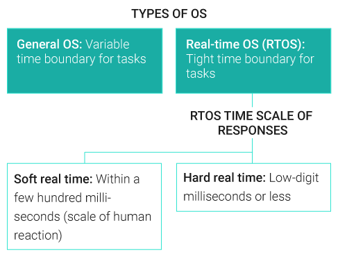
#### 1.2 Các đặc trưng của RTOS
- High performance
- Safety and security
- Priority-based scheduling
- Small

#### 1.3 Cách hoạt động của RTOS
Điều phối các task, lập lịch và phân mức ưu tiên cho task
Cơ chế Multi-Tasking
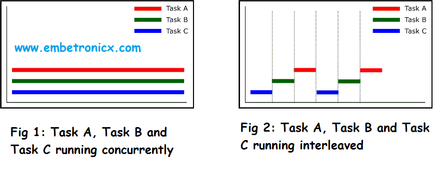
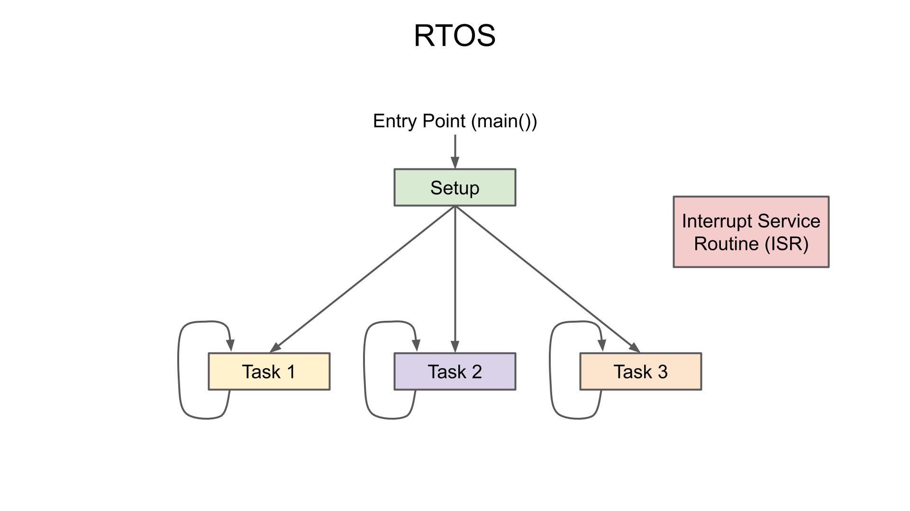

#### 1.4 Kernel
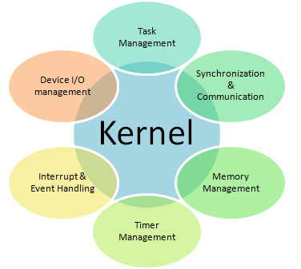
Kernel trong RTOS là phần lõi của hệ điều hành, chịu trách nhiệm quản lý các tài nguyên hệ thống và điều phối việc thực thi các tác vụ (tasks) trong hệ thống. Kernel trong RTOS thường được thiết kế đặc biệt để đảm bảo đáp ứng các yêu cầu thời gian thực, tức là các tác vụ phải được thực thi trong các khoảng thời gian cố định hoặc không được chậm trễ quá mức.

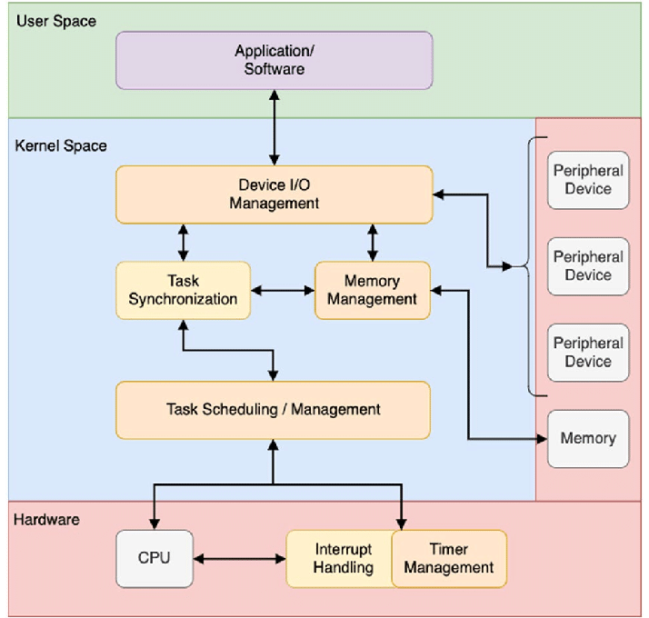

#### 1.5 FreeRTOS

Một RTOS quá quen thuộc với các lập trình viên nhúng và vi điều khiển STM32, FreeRTOS là một RTOS mã nguồn mở. Ưu điểm của FreeRTOS là kích thước khá nhỏ gọn (vài KB), hỗ trợ nhiều thuật toán lập lịch, và dễ dàng porting sang các dòng vi điều khiển lõi ARM, AVR,...

### PHẦN 02 TASKS
#### 2.1 Task
Task là một đoạn chương trình thực thi một hoặc nhiều nhiệm vụ nào đó, được Kernel quản lý.

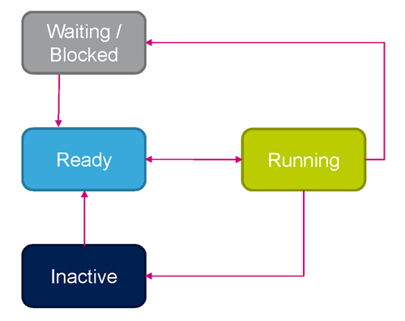
```cpp
Các trạng thái của task:

*RUNNING: Đang thực thi
Task đang chạy
*READY: Sẵn sàng để thực hiện
Task đang chờ để được thực thi
*BLOCKED: Chờ sự kiện
Một task có thể bị blocked khi đang chờ dữ liệu từ một queue, một semaphore, hoặc một tài nguyên khác mà chưa sẵn sàng, ví dụ như nếu đang thực thi mà dùng vTaskDelay 
thì task cũng rơi vào trạng thái blocked
*SUSPEND: Tạm dừng
Một task bị tạm ngừng hoặc đình chỉ thực thi bởi system

```
#### 2.2 Cách tạo task bằng freeRTOS

Các API task trong freeRTOS

```cpp

Feature	                        |FreeRTOS API
------------------------------------------------
Define task attribute	        |osThreadDef_t
Create task	                |xTaskCreate               // Tạo task
Terminate task	                |vTaskDelete               // Xóa task
Yield task	                |taskYield                 // Tạm dừng task hiện tại -> chuyển sang task khác ở trạng thái ready
Delay task	                |vTaskDelay                //Làm delay task hiện tại -> chuyển sang task khác ở trạng thái ready
Get task ID	                |xTaskGetCurrentTaskHandle // Lấy ra id của task
Set task priority	        |vTaskPrioritySet          // Set độ ưu tiên
Get task priority	        |uxTaskPriorityGet         // Get độ ưu tiên
Suspend task	                |vTaskSuspend              // Tạm dừng 1 task trong hệ thống cho đến khi call hàm vTaskResume
Suspend all task	        |vTaskSuspendAll           // Tạm dừng mọi task cho đến khi call hàm vTaskResumeAll
Resume task	                |vTaskResume               // Thoát khỏi tạm dừng
Resume all task	                |vTaskResumeAll            // Thoát khỏi tạm dừng
Get state of task	        |eTaskGetState             // Trả về trạng thái của task
List current tasks info	        |vTaskList                 // Lấy ra thông tin các task đang chạy
```

#### 2.3 Scheduling trong FreeRTOS

Priority-based Preemptive Scheduling

 - Mỗi task được gán một mức ưu tiên (priority), và FreeRTOS sẽ luôn chọn task có mức ưu tiên cao nhất để chạy. Nếu một task mới có mức ưu tiên cao hơn task đang chạy, FreeRTOS sẽ tạm hoãn task đang chạy và chuyển sang chạy task có mức ưu tiên cao hơn.

 - FreeRTOS sử dụng một hàng đợi ưu tiên cho các task sẵn sàng thực thi. Khi một task sẵn sàng chạy, hệ thống sẽ chọn task có mức ưu tiên cao nhất từ hàng đợi để thực thi.

- Các task có mức ưu tiên bằng nhau sẽ được thực thi theo kiểu round-robin (theo vòng tròn) nếu không có task nào có mức ưu tiên cao hơn.
##### Theo dõi hình sau để hiểu về round-robin
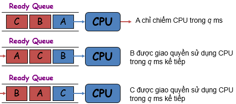


#### 2.4 Memory management

 Các hệ điều hành RTOS thông thường sử dụng cấp phát động (vùng nhớ Heap) 
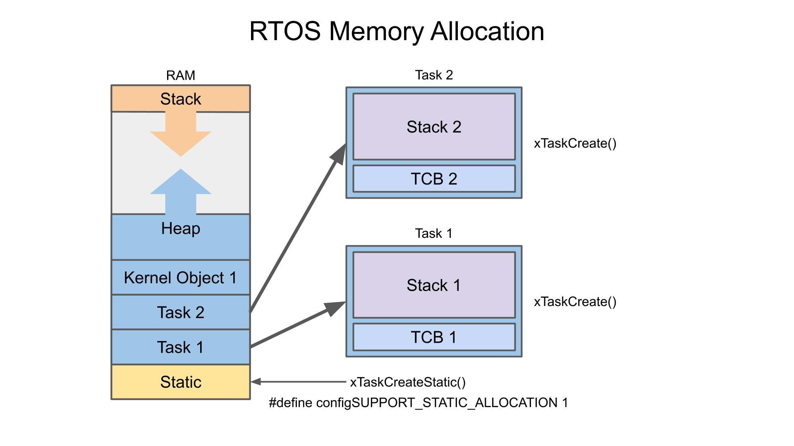
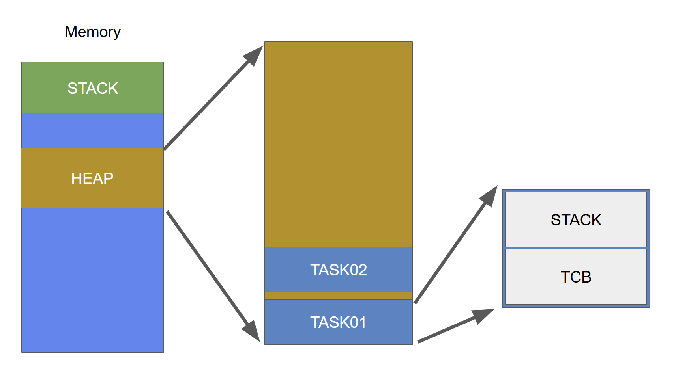

- STACK: Đây là vùng stack nội bộ của task
- TCB (Task control block): Phân vùng này thường lưu trữ một vài thứ: Độ ưu tiên, con trỏ trỏ tới điểm bắt đầu của vùng stack nội bộ

Ví dụ cụ thể
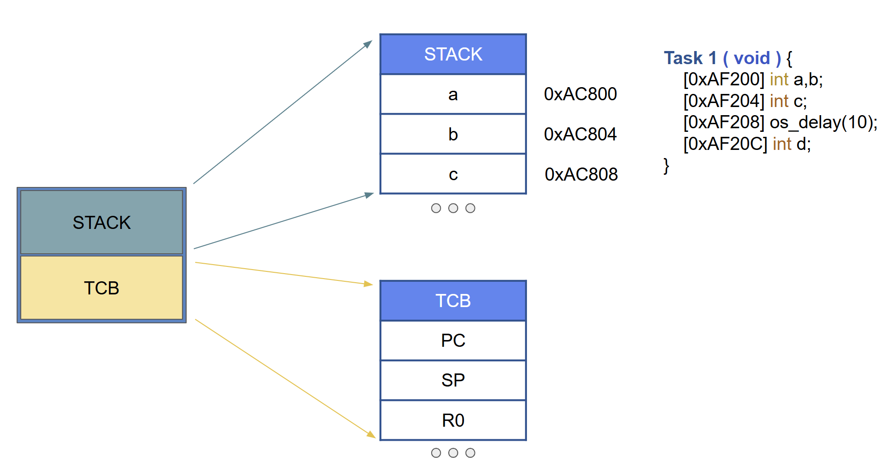

PC, SP là gì?
- SP: Lưu trữ địa chỉ của đầu stack
- PC: Lưu trữ địa chỉ của lệnh tiếp theo
Trong arm cortex M3+
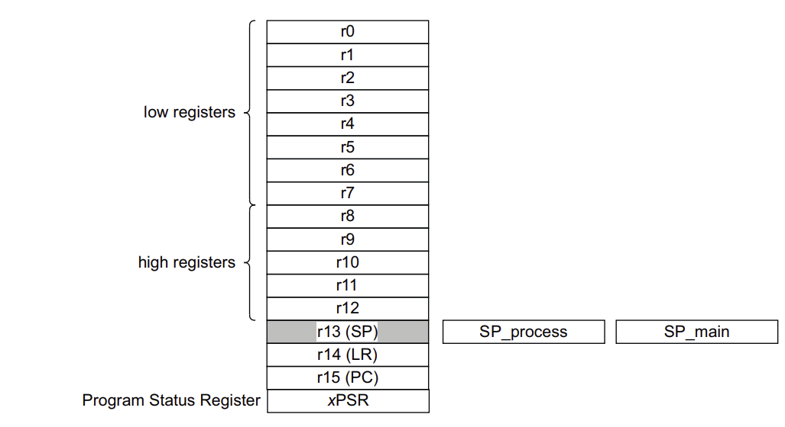


Cách quản lý Heap của freeRTOS
```cpp
- Heap_1: Không cho phép giải phóng bộ nhớ.
- Heap_2: Cho phép giải phóng bộ nhớ, nhưng không đặt các vùng Task cạnh nhau. 
- Heap_3: Dùng malloc() và free() chuẩn của c -> có thể cấp phát và giải phóng bộ nhớ
⚠️ Có một chú ý ở đây là: Vùng nhớ Task sau khi free() sẽ là vùng free space.
--> Khi nó thành free space thì với các heap trên sẽ gây ra phân mảnh bộ nhớ --> khiến nó không còn được sử dụng một cách linh hoạt nữa
- Heap_4: Có thể giải phóng bộ nhớ và phân mảnh bộ nhớ hiệu quả hơn
- Heap_5: Có thể giải phóng bộ nhớ và phân mảnh bộ nhớ hiệu quả hơn

Tùy vào ứng dụng cụ thể cũng như tài nguyên của hệ thống, chúng ta sẽ có những cách thiết kế khác nhau
-> Dùng heap4
```
Ví dụ cụ thể
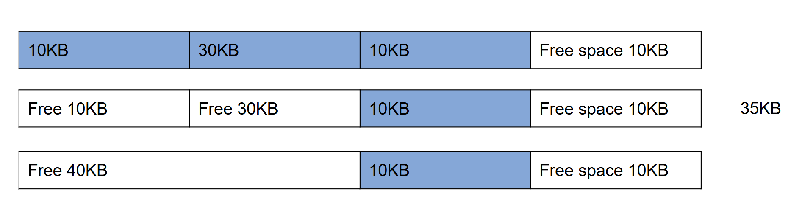

#### 2.5 Context switch

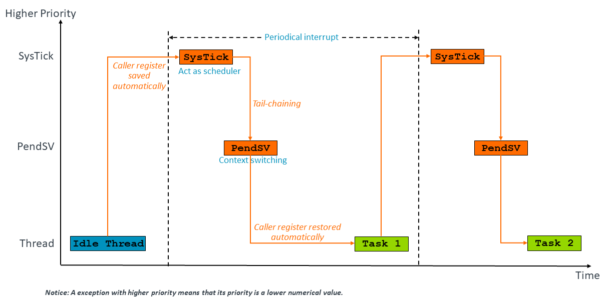

Chuyển đổi ngữ cảnh là quá trình diễn ra khi chuyển đổi qua lại giữa hai task với nhau

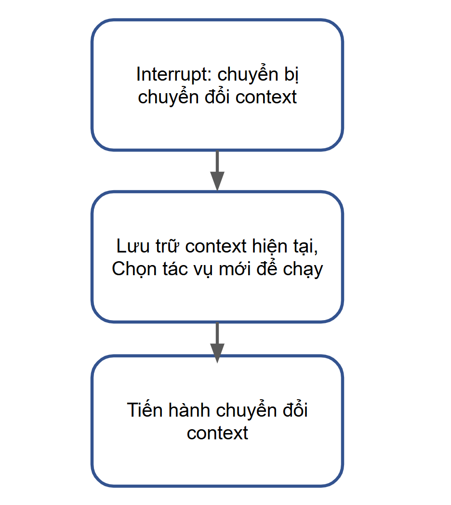

Mọi người có thể thấy ở đây có khái niệm về PendSV và Systick
- PendSV (Pending Supervisor Call) là một loại exception đặc biệt trên vi điều khiển lõi ARM Cortex-M, được thiết kế để hỗ trợ quản lý ngữ cảnh
(context switching) trong hệ điều hành thời gian thực (RTOS), giúp chuyển đổi giữa các task hiệu quả và đơn giản. Bản chất PendSV là ngắt phần mềm
- SysTick là một bộ đếm thời gian như kiểm tra thời gian của các tác vụ đang chạy hoặc quyết định xem có cần phải thực hiện context switch hay không

##### Về cơ bản thì quá trình context switching sẽ diễn ra như sau:
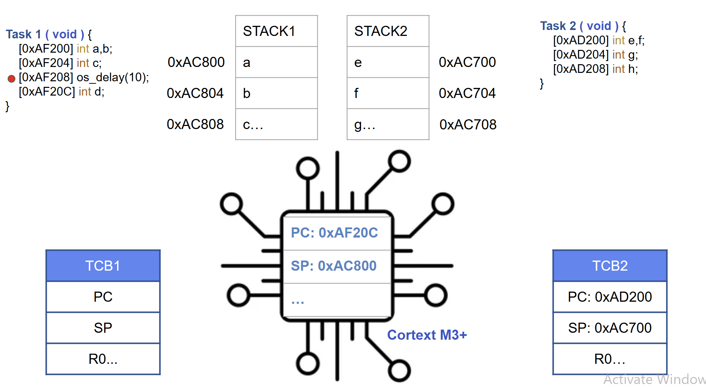
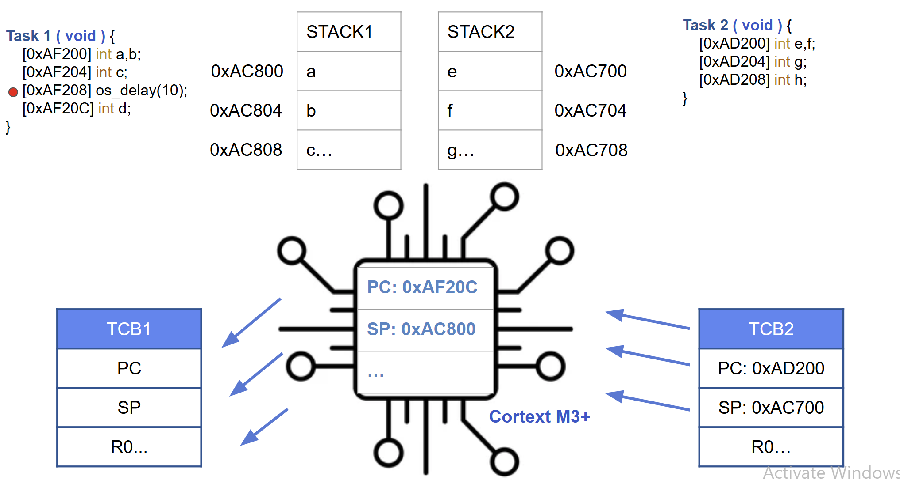
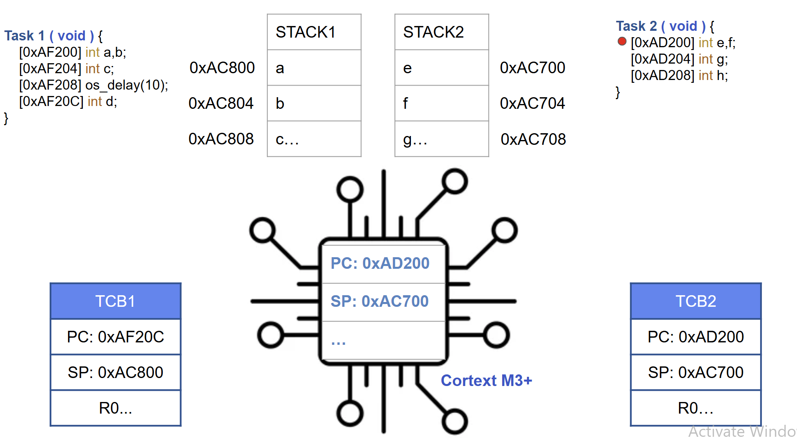

### PHẦN 03 Chia sẻ dữ liệu giữa các task
Qua những phần trên thì chúng ta đã biết cách tạo các task độc lập để chạy với nhau, tuy nhiên có một vấn đề đưa ra như sau:
```cpp
Task 01: Đọc dữ liệu khí gas
Task 02: Còi cảnh báo khí gas quá lớn
Dễ thấy 2 task này phải dùng chung dữ liệu với nhau --> Nếu không thì khó lói 
```
#### 3.1 Chia sẻ dữ liệu giữa các task

```cpp
---------------------------------------------------------------------------
Name         |  Desciption                                                |
---------------------------------------------------------------------------
Queues       | Gửi nhận dữ liệu theo kiểu FIFO.                           |
Semaphores   | Đồng bộ hóa việc truy cập tài nguyên chung.                |
Mutexes      | Đồng bộ hóa việc truy cập tài nguyên chung.                |
Event Groups | Đồng bộ hóa và truyền tín hiệu trạng thái giữa các tác vụ. |
---------------------------------------------------------------------------
```
Có nhiều bạn hỏi vậy dùng global variable có được không?
```cpp
--> Được nhưng không tối ưu: Chỉ phù hợp với dự án nhỏ ít task, nếu có nhiều task sẽ rất loạn
```
#### 3.2 Queues
Queue API
```cpp
Feature	                                               | RTOS API        |
--------------------------------------------------------------------------
Create message queue	                               | osMessageQCreate|	
Get message	                                       | osMessageQGet	 |
Put message	                                       | osMessageQPut	 |
Receive message withoutremoving message from queue     | osMessagePeek   |	
Create mail queue	                               | osMailCreate	 |
Get mail	                                       | osMailGet	 |
Put mail	                                       | osMailPut	 |
Allocate memory block formail queue	               | osMailAlloc	 |
Free memory for mailqueue	                       | osMailFree      |
```
Queue hoạt động theo cơ chế FIFO: vào trước ra trước

##### Cơ chế hoạt động
Khi một Task muốn truyền dữ liệu sang Task khác, nó sẽ đặt dữ liệu này vào Queue, cùng với đó là ID của Task mà nó muốn truyền tới

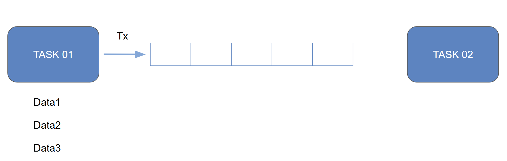
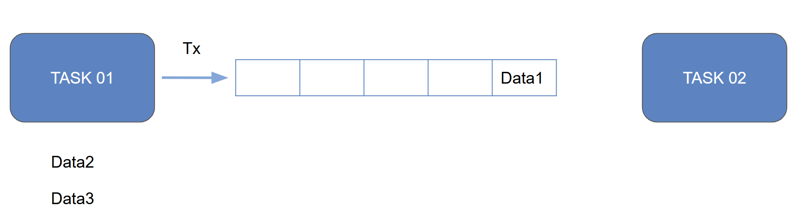
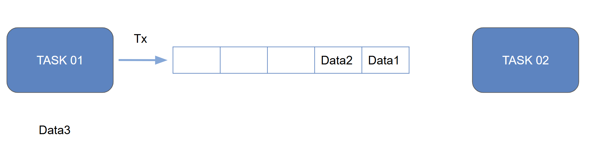
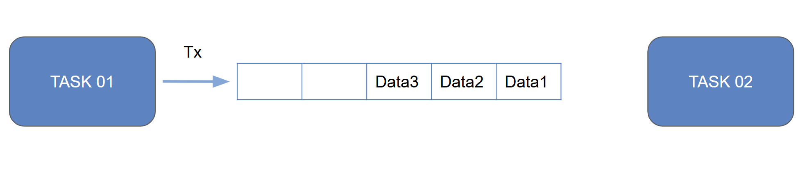
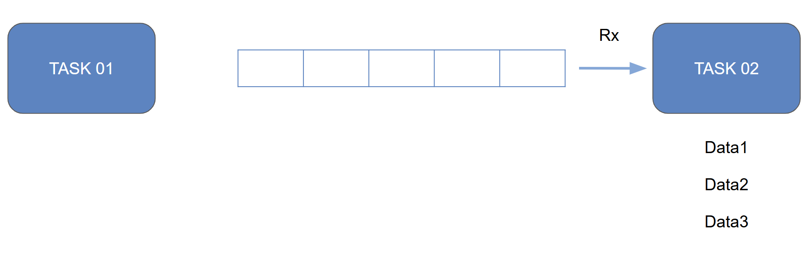

Queue trong RTOS gồm:
```cpp
- Message queue : Truyền dữ liệu dạng đơn
- Mail queue    : Truyền dữ liệu dạng khối
```
Hay hiểu một cách đơn giản thì 
```cpp
- Message queue : Xếp 1 hàng, hay trong lập trình gọi là mảng 1 chiều
- Mail queue    : Xếp nhiều hàng, hay trong lập trình gọi là mảng 2 chiều
```
#### 3.3 Semaphore
Semaphore gồm:
```cpp
- Binary Semaphore: Quản lý đồng bộ 1 tài nguyên
- Counting Semaphore: Quản lý đồng bộ nhiều tài nguyên
```

- Bản chất nó là một hàng đợi đặc biệt nhưng nó không liên quan tới việc truyền dữ liệu
- Semaphone hoạt động như một chìa khóa cho việc truy cập tới tài nguyên
- Để có thể sử dụng tài nguyên, task cần require chìa khóa để sử dụng
- Nếu chìa khóa đang không có task nào sử dụng thì task có thể sử dụng tài nguyên
- Sau khi dùng xong, task này phải release chìa khóa để các task khác có thể sử dụng, tuy nhiên với counting semaphore thì nhiều task có thể truy cập tài nguyên đồng thời. Semaphore có thể được giải phóng (signal) và chờ (wait) bởi bất kỳ tác vụnào, không nhất thiết phải là tác vụ đã khóa semaphore. Điều này làm cho semaphore linh hoạt hơn trong việc quản lý tài nguyên chia sẻ.

```cpp
Hoạt động theo cơ chế Signaling
```

 ⚠️ Note: Khi sử dụng semaphore sẽ có thể gặp một vấn đề là đảo ngược độ ưu tiên
 Tức là khi task có độ ưu tiên thấp đang giữ semaphore thì task có độ ưu tiên cao hơn phải đợi task có độ ưu tiên thấp hơn thực thi xong thì mới được sử dụng

##### Ví dụ cụ thể

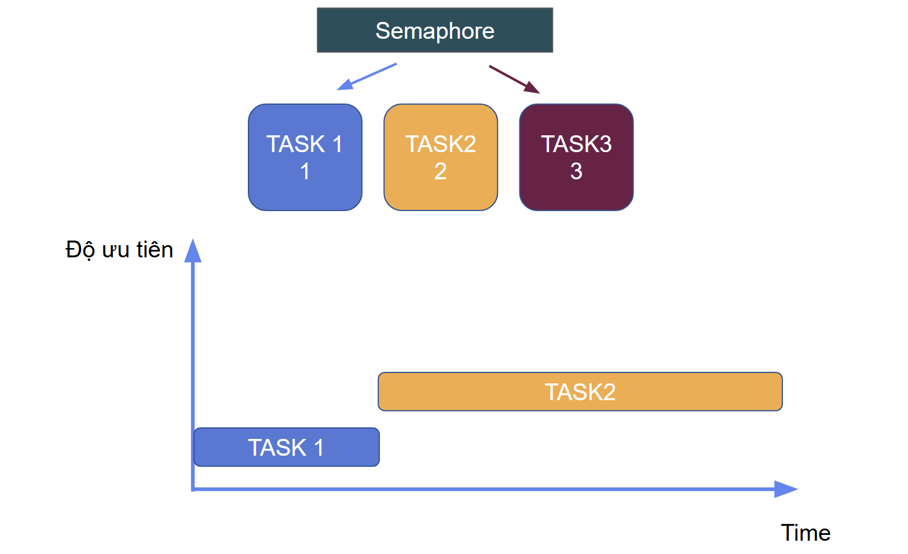

#### 3.4 Mutex

API Mutex

```cpp
-----------------------------------------------------
Feature	                |CMSIS RTOS                 |
-----------------------------------------------------
Create mutex	        |osMutexCreate	            |
Delete mutex	        |osMutexDelete	            |
Acquire mutex	        |osMutexWait	            |
Release mutex	        |osMutexRelease	            |
Create recursivemutex	|osRecursiveMutexCreate	    |
Acquire recursivemutex	|osRecursiveMutexWait	    |
Release recursivemutex	|osRecursiveMutexRelease    |
-----------------------------------------------------
```

- Là 1 Semaphore đặc biệt 
- Mutex (Mutial Exclusion) tức là loại trừ lẫn nhau, thực chất nó là một Key (Khóa) đảm bảo chỉ có một task duy nhất được quyền truy cập vào tài nguyên tại một thời điểm.
- Nó hoạt động theo cơ chế blocking, tức là một task sẽ Acquire Mutex khi cần sử dụng tài nguyên chung, và sau khi sử dụng xong thì nó sẽ Release Mutex để cho các task khác có thể thực hiện. Nếu Mutex đang được một task sử dụng thì những task khác sẽ phải chờ để nhận được Mutex

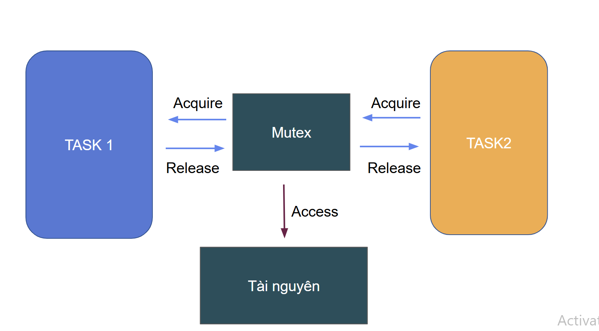


⚠️ Nói chuẩn ra là gặp trường hợp y như thằng semaphore, tuy nhiên thằng này có cơ chế gỡ rối đó là " Kế thừa ưu tiên "
- Mutex còn có cơ chế kế thừa độ ưu tiên
VD cụ thể: task A đang giữ Mutex, nếu task B có mức độ ưu tiên cao hơn muốn lấy Mutex thì task A sẽ kế thừa độ ưu tiên của task B. Khi task A nhả Mutex thì nó sẽ trở về mức ưu tiên ban đầu
```cpp
⚠️ Tuy nhiên đối với thằng Mutext cũng có trường hợp rơi vào bế tắc như sau:
A giữ Mutex M1, B giữ Mutex M2
A cần Mutex M2 để chạy -> A bị block do B đang giữ M2
B cần Mutex M1 để chạy -> B bị block do A đang giữ M1
--> Cả 2 đều bị block 
--> Để giải quyết vấn đề này --> Cần có timeout, nếu không lấy được M2 -> giải phóng M1 và tương tự như vậy
```

#### 3.5 Mutex & Binary Semaphore 

Mutex và Binary Semaphore có cách hoạt động tương đối giống nhau, tuy nhiên cần phân biệt rõ
```cpp
Name	            | Mutex	                   | Binary Semaphore
-----------------------------------------------------------------------------------
Cơ chế	            | Locking 	                   | Signaling 
Ownership           | Chỉ task sở hữu nhả được     | Bất kỳ task nào cũng nhả được
Priority Inheritance| Có   	                   | Không
Tốc độ	            | Chậm hơn                     | Nhanh hơn 
Ứng dụng            | Bảo vệ tài nguyên duy nhất   | Đồng bộ đơn giản 
```

#### 3.6 Event group
### PHẦN 04 KẾT LUẬN
```cpp
Việc tạo Task và hiểu cơ chế Scheduling rất quan trọng khi học hệ điều hành RTOS, chúng giúp chúng ta có cái nhìn chính xác 
về quá trình khởi tạo và chạy các Task.

Để đảm bảo các Task được chạy một cách tối ưu, thông thường người ta sẽ thiết kế Timing diagram cho chương trình của mình. 
Điều này sẽ giúp các luồng được quản lý chặt chẽ hơn.

```

Task
Scheduling
Memory management
Context switch
Sync&Relation task
Queue
Semaphore
Mutex

