# Chuẩn giao tiếp USB
## PHẦN 01: TỔNG QUAN

Giao thức USB, còn được gọi là Universal Serial Bus, lần đầu tiên được tạo ra và giới thiệu vào năm 1996 để có thể dùng chung 1 giao tiếp trên vô số thiết bị điện tử khác nhau

Có rất nhiều thiết bị sử dụng giao tiếp USB để kết nối như:
- Bàn phím.
- Chuột máy tính.

```cpp
|Chế độ	        | Viết tắt |Tốc độ truyền nhận              |Phiên bản
---------------------------------------------------------------------
| Low speed	| LS       |1.5 Mbit/s (187.5 KB/s)	    |USB 1.0
| Full speed	| FS	   |12 Mbit/s (1.5 MB/s)	    |USB 1.0
| High speed	| HS	   |480 Mbit/s (60 MB/s)	    |USB 2.0
| SuperSpeed	| SS	   |5 Gbit/s (625 MB/s)	            |USB 3.0
| SuperSpeed+	| SS+	   |10 Gbit/s (1.25 GB/s)	    |USB 3.1
| SuperSpeed+	| SS+	   |20 Gbit/s (2.5 GB/s)	    |USB 3.2
```
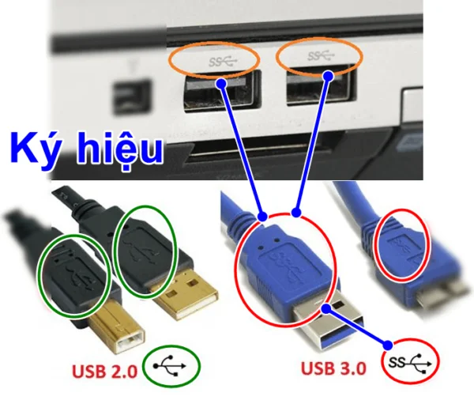
```cpp
Với USB 2.0
Nó thường có 4 chân    | VCC | GND | D+ | D- |
```
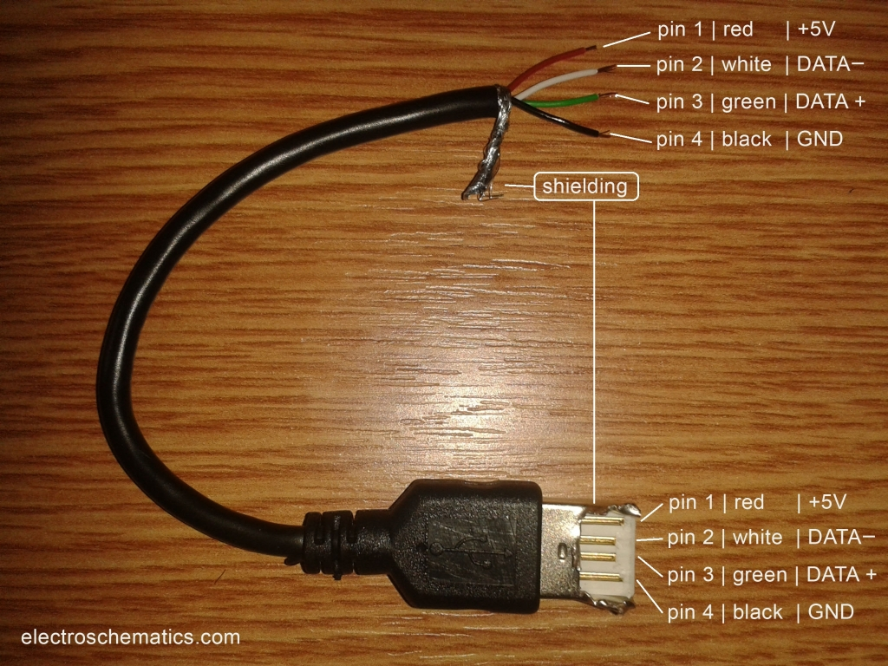

## PHẦN 02: GIỚI THIỆU VỀ USB
```cpp
Một hệ thống USB sẽ gồm các thành phần:
- USB devices: bàn phím, chuột,...
- USB host: máy chủ
- USB interconnect: hub, bus giao tiếp, nó là các thành phần trung gian để giúp device giao tiếp với host
```

```cpp
Một USB Interconnect bao gồm các thành phần con như sau:
- Bus Topology: Kiểu kết nối giữa USB device và USB host.
- Inter-layer Relationship
- Data Flow Models: Cách thức data được trao đổi giữa USB producer và consumer.
- USB Schedule
USB kết nối theo kiểu hình cây theo tầng. Trong đó, hub là một center của mỗi cây con, mỗi cạnh là một kết nối point-to-point giữa host và hub hoặc function, 
hoặc hub kết nối tới một hub khác hoặc function.USB devices có thể là Hub hoặc Function.
```
### 2.1 Các trạng thái (state)
```cpp
- IDLE state

Low speed: D- high, D+ low
Full speed: D+ high, D- low

- J state
- K state
```
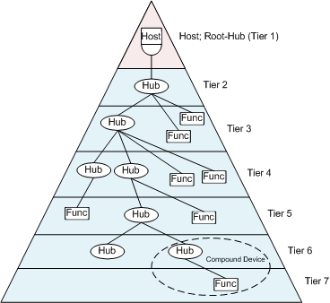

## PHẦN 03: USB PROTOCOL

### 3.1 Các trường dữ liệu trong packet
Mỗi một packet lại có cái trường (field) riêng, trong đó:

- Sync field: Tất cả các packet phải được bắt đầu bằng trường Sync. Trường này dài 8 bit (full/low speed) hoặc 32 bit (high speed) và được sử dụng để đồng bộ clock giữa receiver và transmitter. Hai bit cuối cho biết nơi bắt đầu của trường PID.
- Packet Identifier Field - PID nghĩa là Packet ID. Trường này được sử dụng để xác định loại packet được gửi, nó gốm 4 bit cao để xác định, 4 bit cuối để check 4 bit đầu
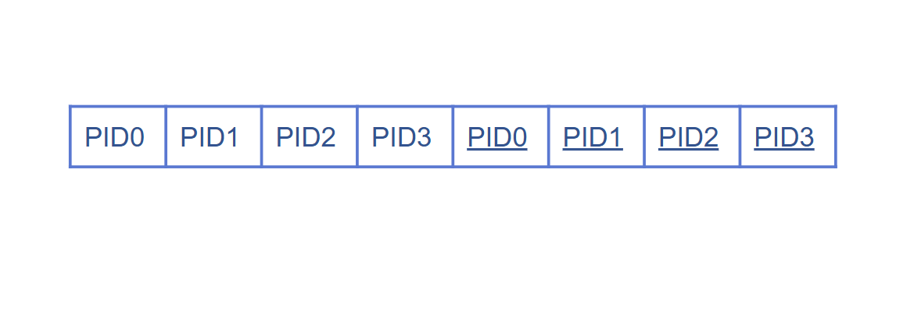
Các PID được thể hiện tại bảng sau:

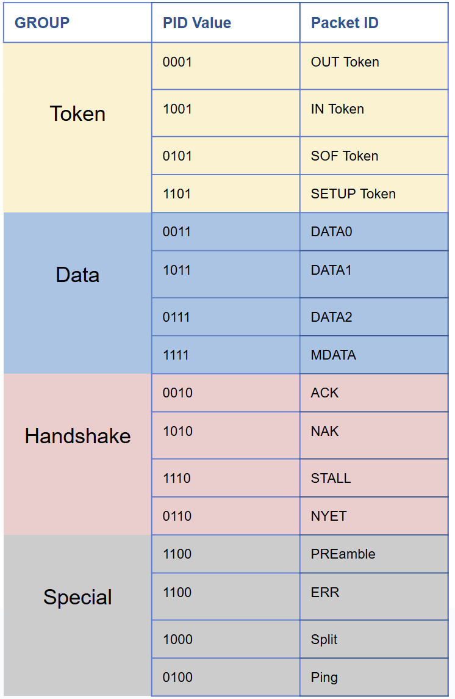
- Function Address Field: Cho biết địa chỉ của function cụ thể. Độ dài 7 bit cho phép hỗ trợ 127 device. Address 0 không hợp lệ vì nó được dùng làm default address.
- Endpoint Field: Độ dài 4 bit cho phép hỗ trợ 16 endpoint. Tuy nhiên, đối với low speed device chỉ có thêm 2 endpoint được thêm với default pipe (max 3 endpoint).
- Data Field: Trường dữ liệu có thể nằm trong khoảng 0 đến 1024 byte. Các bit trong mỗi byte được dịch từ LSB đầu tiên. Kích thước của data field tuỳ thuộc vào transfer type.
- Cyclic Redundancy Checks - CRC: được sử dụng để bảo vệ tất cả các trường không phải là PID trong token và data packet. Các token packet có 5 bit CRC, trong khi data packets có 16 bit CRC.
- End Of Packet - EOP: cho biết packet kết thúc.

### 3.2 Các packet USB

Start of Frame Packets: Sử dụng để chỉ ra sự bắt đầu của một khung dữ liệu mới.
Token Packets: Cho biết loại giao dịch phải tuân theo.
Data Packets: Gói chứa dữ liệu cần truyền, nhận.
Handshake Packets: Sử dụng để xác nhận các gói dữ liệu đã nhận hoặc để báo cáo lỗi…

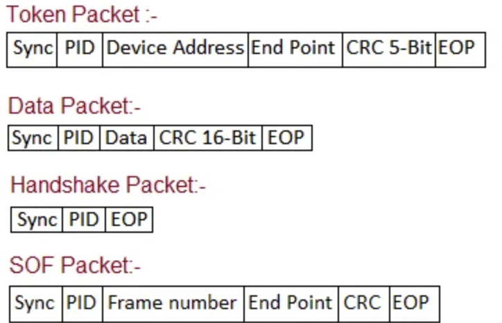

#### 3.2.1 Start of Frame Packets
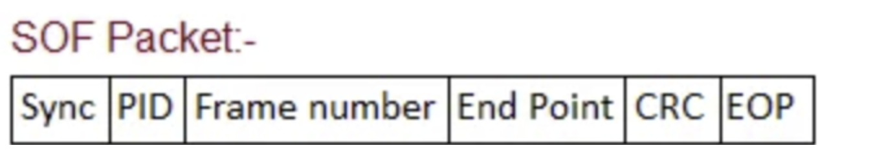
Báo hiệu bắt đầu 1 frame mới
Packet SOF, chứa dữ liệu là một giá trị 11 bit

#### 3.2.1 Token packets
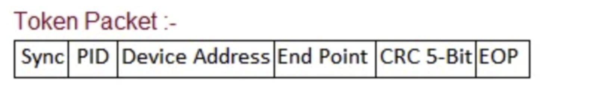
Có 3 loại packets token
IN – Báo cho USB Device biết host muốn đọc thông tin từ nó
OUT – Báo cho USB Device biết host gửi thông tin cho nó
SETUP – Báo cho USB Device biết host sẽ truyền thông tin điều khiển

#### 3.2.2 Data packets
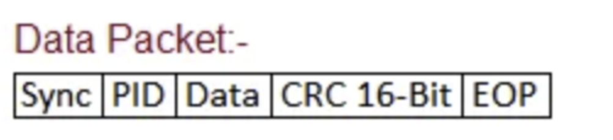
Có 2 loại Packet data, mỗi loại đều có thể truyền tối đa 1024 byte dữ liệu.
- Data0
- Data1

Ở Low Speed, cho phép tối đa 8 bytes payload.(phần Data ở định dạng trên)
Ở Full Speed,  cho phép tối đa 1023 byte payload.
Ở High Speed, cho phép tối đa 1024 bytes.
Data phải được gửi thành nhiều byte.

#### 3.2.3 Handshake packets
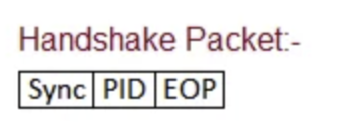
Có 3 loại Packet Handshake là :

- ACK – Cho biết Packet đã được gửi nhận thành công chưa
- NAK – Cho biết Device không tạm thời không thể gửi hoặc nhận dữ liệu. Ngoài ra, gói này cũng được sử dụng trong Transaction dạng Interrupt để báo cho host biêt rằng device chẳng ó gì để gửi.
- STALL – Device báo rằng trạng thái hiện tại cần cần thiệp từ phía Host.

## PHẦN 04: USB DEVICE

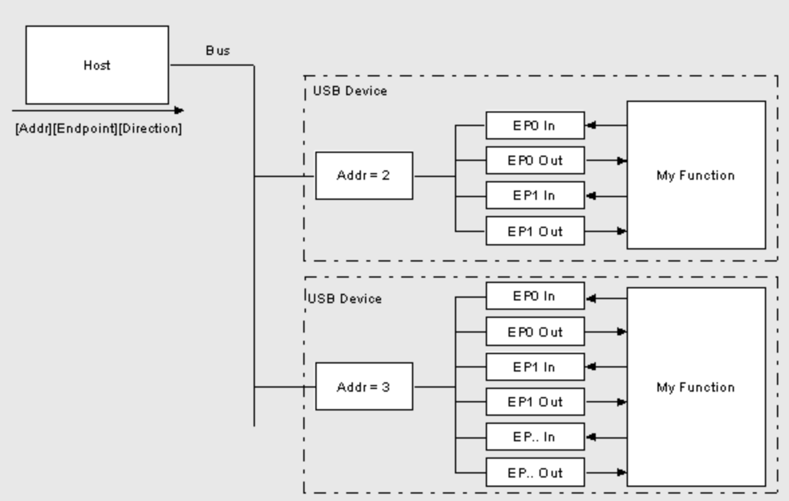

### EndPoint
EndPoint chưa buffer: hiểu đơn giản nó là bể chứa dữ liệu cũng được
Phần mềm sẽ phải xử lý ngắt, đọc dữ liệu từ buffer của EndPoint, rồi parse Device Descriptor Request.
Giả sử driver gửi một Packet đến EP1 của thiết bị. Dữ liệu này được ném từ Host, và trôi xuống EP1 OUT Buffer. Firmware phía USB Functions cứ thế đọc dữ liệu này. Rồi xử lý tóe loe gì đó. Sau đó nếu nó muốn trả dữ liệu nào đó về Host, USB Functions lại không thể tống dữ liệu đó vào cái Channel lúc trước được (vì ngược chiều, đâm nhau thì toi). Vì thế, nó ghi dữ liệu vào EP1 IN Bufer. Dữ liệu được ghi vào cứ nằm ở đấy đến khi nào Host gửi Packet IN (yêu cầu lấy dữ liệu) thì mới được chuyển đi
```cpp
EP_IN: 
EP_OUT:
```
### Pipes
Pipe là một kết nối logical giữa Host và 1 hoặc nhiều Endpoint, coi nó như kênh truyền cũng được

- Cấu trúc của Pipe thường bao gồm:
```cpp
- Địa chỉ endpoint: Mỗi pipe được xác định thông qua địa chỉ của endpoint.
- Hướng truyền tải: Pipe có thể truyền dữ liệu từ host tới device (IN) hoặc từ device tới host (OUT).
- Loại transfer: Xác định cách thức dữ liệu sẽ được truyền (control, bulk, interrupt,...).
    + Control (được sử dụng trong các yêu cầu điều khiển)
    + Bulk (dành cho các truyền tải dữ liệu lớn)
    + Interrupt (dành cho các truyền tải có độ trễ thấp)
- Tốc độ và băng thông: Mỗi loại transfer có tốc độ và băng thông khác nhau
```

```cpp
Có 2 loại
- Stream Pipe (Pipe dạng dòng): truyền dữ liệu không định dạng trước, khi sử dụng loại này bạn có đơn giản là có thể gửi bất cứ dữ 
liệu gì ở 1 đầu, và lấy dữ liệu ra ở đầu còn lại. Luồng dữ liệu sử dụng Pipe này thường được định nghĩa trước, hoặc là IN hoặc là 
OUT. Pipe dạng dòng hỗ trợ phương thức truyền Bulk, Isochronous và Interrupt. Stream có thể được điều khiển (controlled về phần 
mềm) bởi Host hoặc Device.
- Message Pipi (Pipe truyền messsage): Dùng để truyền dữ liệu đã được định nghĩa theo USB Format. Được điều khiển cũng như xuất 
phát từ Host. Dữ liệu được truyền đi theo hướng mong muốn dựa trên request từ Host. Nó hỗ trợ truyền dữ liệu cả 2 hướng và chỉ hỗ 
trợ Control Transfer thôi
```
## PHẦN 05: STM32 USB CDC
Khi sử dụng thằng này thì chính là sử dụng thông qua Bulk

- Bulk Transfer được sử dụng khi cần truyền tải lượng dữ liệu lớn (ví dụ như khi sử dụng thiết bị USB như serial port hoặc các thiết bị lưu trữ như USB flash drives)

### 5.1 USB CDC là gì?
Trong STM32f103c8t6 chỉ hỗ trợ giao thưc USB kiểu Device, thế nên ta sẽ sử dụng kit Bluepill như một thiết bị để truyền nhận dữ liệu giữa nó và máy tính.

### 5.2 Lập trình USB CDC với STM32
Cùng code và đọc 2 chân tín hiệu D+, D- để biết dữ liệu được truyền đi như thế nào
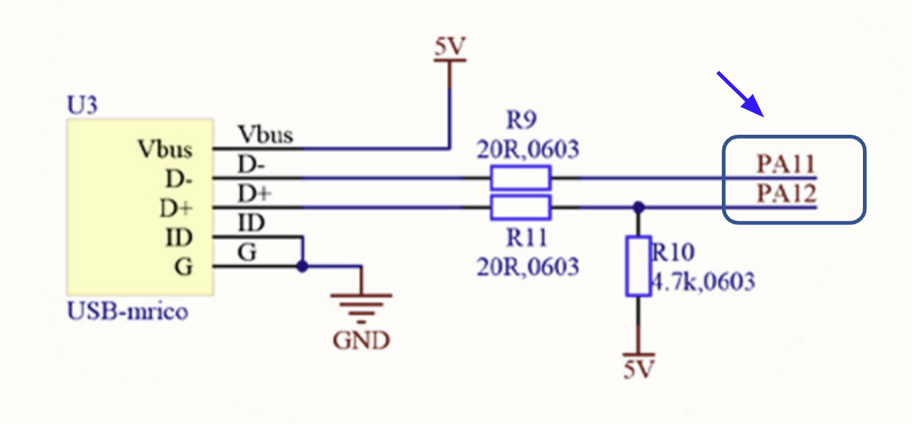


## TÀI LIỆU THAM KHẢO

https://lazytrick.wordpress.com/2016/03/21/usb-cho-dev-chap-03-giao-thuc/ 
https://www.beyondlogic.org/usbnutshell/usb3.shtml
