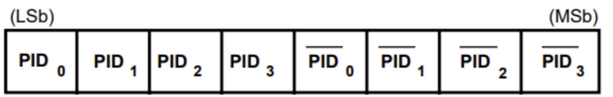
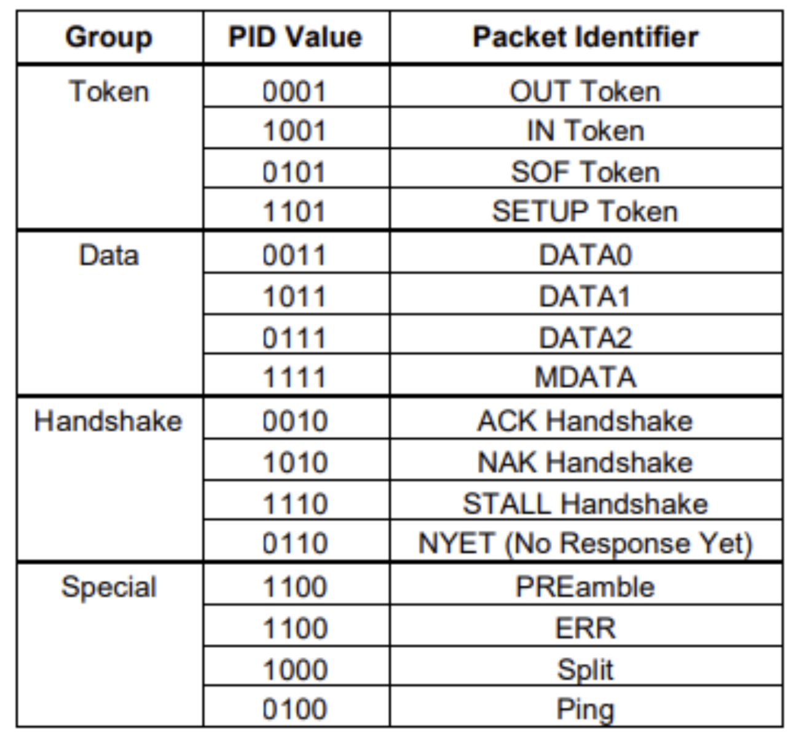
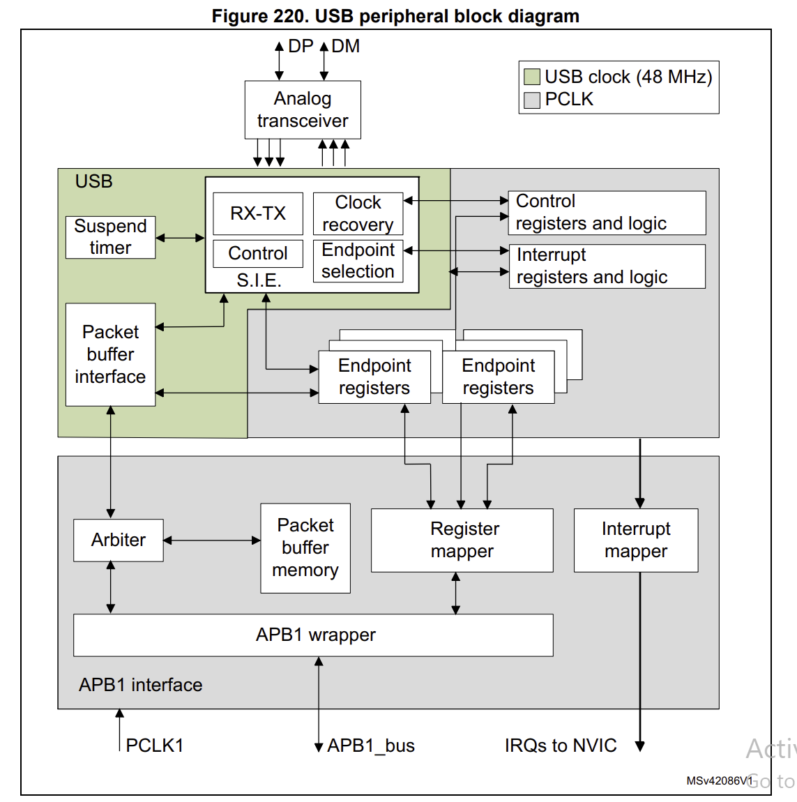

# Chuẩn giao tiếp USB
## PHẦN 01: TỔNG QUAN

Giao thức USB, còn được gọi là Universal Serial Bus, lần đầu tiên được tạo ra và giới thiệu vào năm 1996 để có thể dùng chung 1 giao tiếp trên vô số thiết bị điện tử khác nhau

Có rất nhiều thiết bị sử dụng giao tiếp USB để kết nối như:
- Bàn phím.
- Chuột máy tính.

```cpp
|Chế độ	        | Viết tắt |Tốc độ truyền nhận              |Phiên bản
---------------------------------------------------------------------
| Low speed	| LS       |1.5 Mbit/s (187.5 KB/s)	    |USB 1.0
| Full speed	| FS	   |12 Mbit/s (1.5 MB/s)	    |USB 1.0
| High speed	| HS	   |480 Mbit/s (60 MB/s)	    |USB 2.0
| SuperSpeed	| SS	   |5 Gbit/s (625 MB/s)	            |USB 3.0
| SuperSpeed+	| SS+	   |10 Gbit/s (1.25 GB/s)	    |USB 3.1
| SuperSpeed+	| SS+	   |20 Gbit/s (2.5 GB/s)	    |USB 3.2
```

```cpp
Nó thường có 4 chân    | VCC | GND | D+ | D- |
```


## PHẦN 02: GIỚI THIỆU VỀ USB
```cpp
Một hệ thống USB sẽ gồm các thành phần:
- USB devices: bàn phím, chuột,...
- USB host: máy chủ
- USB interconnect: hub, bus giao tiếp, nó là các thành phần trung gian để giúp device giao tiếp với host
```

```cpp
Một USB Interconnect bao gồm các thành phần con như sau:
- Bus Topology: Kiểu kết nối giữa USB device và USB host.
- Inter-layer Relationship
- Data Flow Models: Cách thức data được trao đổi giữa USB producer và consumer.
- USB Schedule
USB kết nối theo kiểu hình cây theo tầng. Trong đó, hub là một center của mỗi cây con, mỗi cạnh là một kết nối point-to-point giữa host và hub hoặc function, 
hoặc hub kết nối tới một hub khác hoặc function.USB devices có thể là Hub hoặc Function.
```
### 2.1 Các trạng thái (state)
```cpp
- IDLE state

Low speed: D- high, D+ low
Full speed: D+ high, D- low

- J state
- K state
```


## PHẦN 03: USB PROTOCOL

Mỗi một USB Transaction chia thành các packet:
```cpp
- Token Packet: Chỉ được gửi bởi host và cho biết type transaction.
- Optional Data: Tùy thuộc vào loại transaction, packet này chứa data payload được gửi bởi host cho các OUT transaction và device cho các IN transaction.
- Status Packet: Gói bắt tay, xác nhận transaction thành công hay thất bại.
```
### 3.1 Các trường dữ liệu trong packet
Mỗi một packet lại có cái trường (field) riêng, trong đó:

- Sync field: Tất cả các packet phải được bắt đầu bằng trường Sync. Trường này dài 8 bit (full/low speed) hoặc 32 bit (high speed) và được sử dụng để đồng bộ clock giữa receiver và transmitter. Hai bit cuối cho biết nơi bắt đầu của trường PID.
- Packet Identifier Field - PID: gồm 4 bit cao cho biết packet type field và 4 bit thấp dùng để check field.  PID cho biết packet type, định dạng của packet và type error detection của packet. 4 bit check field là phần bù của 4 bit packet type field, nhằm đảm bảo dữ liệu được truyền chính xác, cho biết packet dùng để làm gì, hướng dữ liệu của packet,..., nếu là Handshake packet, chúng sẽ cho biết đã truyền nhận thành công hay chưa.


- Function Address Field: Cho biết địa chỉ của function cụ thể. Độ dài 7 bit cho phép hỗ trợ 127 device. Address 0 không hợp lệ vì nó được dùng làm default address.
- Endpoint Field: Độ dài 4 bit cho phép hỗ trợ 16 endpoint. Tuy nhiên, đối với low speed device chỉ có thêm 2 endpoint được thêm với default pipe (max 3 endpoint).
- Data Field: Trường dữ liệu có thể nằm trong khoảng 0 đến 1024 byte. Các bit trong mỗi byte được dịch từ LSB đầu tiên. Kích thước của data field tuỳ thuộc vào transfer type.
- Cyclic Redundancy Checks - CRC: được sử dụng để bảo vệ tất cả các trường không phải là PID trong token và data packet. Các token packet có 5 bit CRC, trong khi data packets có 16 bit CRC.
- End Of Packet - EOP: cho biết packet kết thúc.


### 1.2 Packets USB
Token Packets: Cho biết loại giao dịch phải tuân theo.
Data Packets: Gói chứa dữ liệu cần truyền, nhận.
Handshake Packets: Sử dụng để xác nhận các gói dữ liệu đã nhận hoặc để báo cáo lỗi…
Start of Frame Packets: Sử dụng để chỉ ra sự bắt đầu của một khung dữ liệu mới.


### 1.3 Các frame
- Tất cả các packet đều có frame SYNC và EOP và PID
```cpp
- SYNC: Đồng bộ hóa giữa thiết bị và máy chủ
- PID: Dùng để xác định loại gói được truyền, bản chất chỉ có 4 bit để xác định, tuy nhiên để tăng tính xác thực thì nó gửi lại 4 bit đầu thành 8 bit được truyền đi
"PID = { PID0, PID1, PID2, PID3, PID0', nPID1', nPID2', nPID3 }"
- EOP: End Of Packet
```

